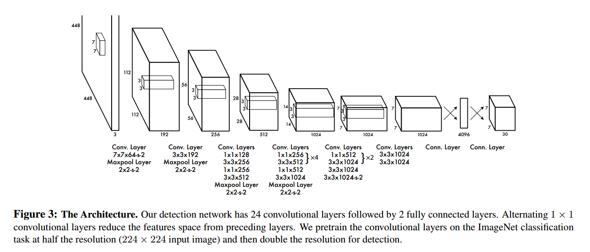
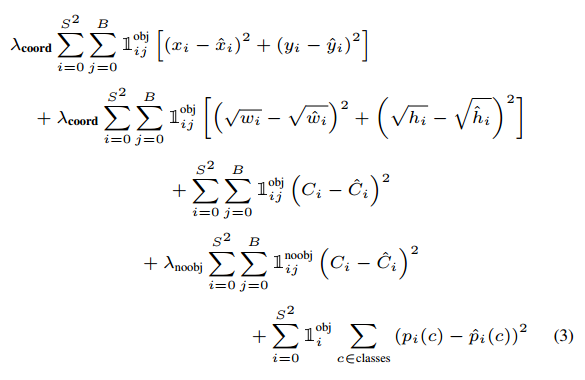

# YOLO algorithm

## Overview

Paper: You only look once

An image is going to be split into SxS grid. For example if you split an image into 3x3 grid, you will have 9 cells
Each cell will output a prediction with a corresponding bounding box. But an object may span over multiple cells and we only want to have one bounding box so the. We would find one cell that responsible for that object and the cell is chosen to be the cell which contains the mid-point of the object.
Each cell would have a top left corner with (0, 0) and the bottom right with coordinate (1, 1)
Each output and label will be relative to the cell. Each bounding box for each cell will have $[x, y, w, h]$. $x$ and $y$ are the coordinates for object midpoint in cell. $x$ and $y$ are in range [0, 1] but w and h can be greater than 1 if object is taller than the cell.

Labels format for one cell:

$label_{cell} = [c_1, c_2,...,c_{20}, p_c, x, y, w, h]$

Where ${c_1, c_2,..., c_{20}}$ is for 20 different classes. $p_c$ is the probability that there is an object (0 or 1). $x, y, w, h$ are for the bounding box coordinates

The predictions will look very similar but we will output two bounding boxes to cover cases

Prediction format:

$pred_{cell}=[c_1, c_2,...,c_{20}, p_{c1}, x, y, w, h, p_{c2}, x, y, w, h]$

Note: A cell can only detect one object

For every cell:

- Target shape for **one image**: $(S, S, 25)$
- Prediction shape for **one image**: $(S, S, 30)$

## Architecture and implementation

## Loss function

Loss function of YOLO-v1 from the paper:

## Acknowledgement
